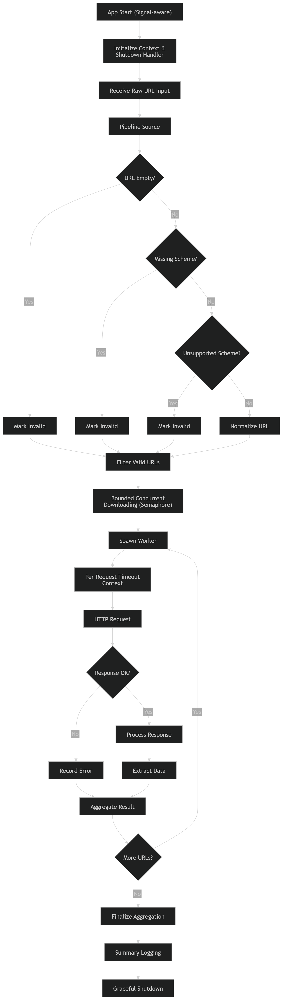

# ConcurFlow

[](https://github.com/SShogun/Concurflow/actions/workflows/ci.yml)

ConcurFlow is a compact Go concurrency reference project that validates URLs, moves them through a cancellable channel pipeline, and downloads valid URLs with bounded parallelism.

The repository focuses on ownership and lifecycle rules that matter in concurrent services: semaphore ownership, cancellation propagation, channel closure, bounded work, deterministic tests, and explicit configuration validation.

## Diagram



## What It Demonstrates

- source -> transform -> sink channel pipelines;
- configurable pipeline buffering;
- semaphore-backed download concurrency limits;
- parent cancellation plus per-download timeouts;
- deterministic result ordering despite concurrent execution;
- fan-in with correct output-channel ownership;
- worker-pool shutdown that is safe against concurrent submissions;
- structured logging and explicit validation failures;
- deterministic concurrency tests using `httptest` and synchronization channels.

## Main Flow

1. The command creates a signal-aware root context.
2. `app.Run` validates configuration and derives the configured overall run timeout.
3. Raw URL records enter the pipeline.
4. The transform stage trims, parses, and classifies each URL.
5. Invalid inputs are retained as structured validation results and filtered before network I/O.
6. The downloader acquires a semaphore permit before starting each request.
7. Every acquired permit is released by the same goroutine that acquired it.
8. Each HTTP request receives its own timeout derived from the parent context.
9. Results are collected in original request order.
10. Parent cancellation is returned to the caller rather than silently swallowed.

## URL Validation

The pipeline currently reports these reasons:

- `empty`
- `malformed_url`
- `missing_scheme`
- `missing_host`
- `unsupported_scheme`
- `fair` for accepted HTTP/HTTPS URLs

A URL is accepted for download only when it parses successfully, uses HTTP or HTTPS, and has a host.

## Concurrency Invariants

### Downloader permit ownership

A goroutine releases a semaphore slot only after successfully acquiring that slot. Cancellation while waiting therefore cannot steal another request's permit or leave an in-flight request blocked during cleanup.

### Mux channel ownership

Input forwarders never close the merged output channel. A single coordinator waits for all forwarders and closes the output exactly once, after all inputs finish or cancellation stops them.

### Worker-pool shutdown

`Shutdown` signals workers before closing the jobs channel, prevents new submissions from racing with channel close, waits for workers, and closes results exactly once. Submissions after shutdown return `pool.ErrClosed`.

## Package Overview

| Package | Responsibility |
| --- | --- |
| `cmd/concurflow` | Program entrypoint and signal-aware shutdown |
| `internal/app` | Configuration validation and top-level orchestration |
| `internal/pipeline` | URL source, transform, sink, buffering, and validation |
| `internal/downloader` | HTTP fetching with bounded concurrency and per-request timeouts |
| `internal/pool` | Bounded worker processing with explicit shutdown lifecycle |
| `internal/mux` | Fan-in utility with coordinated channel closure |
| `internal/config` | Central defaults and validation |
| `internal/logging` | Structured logger setup |
| `internal/demo` | Interactive/example scenarios |

## Configuration Defaults

| Setting | Default | Meaning |
| --- | --- | --- |
| `WorkerCount` | `5` | Worker goroutines in the reusable pool |
| `QueueDepth` | `100` | Buffered worker-pool job queue |
| `PipelineBufferSize` | `10` | Buffer size used by the application's pipeline stages |
| `MaxConcurrentDownloads` | `3` | Maximum in-flight HTTP requests |
| `PerDownloadTimeout` | `10s` | Timeout for each individual request |
| `RunTimeout` | `1m` | Overall application run timeout |

Invalid concurrency counts, negative buffer/queue sizes, and non-positive timeouts fail validation instead of creating deadlocks or invalid channels.

## Build and Run

Requirements: Go 1.25 or newer. Runtime code uses the standard library only.

```bash
go build ./cmd/concurflow
go run ./cmd/concurflow
```

The command uses a small public-URL demo workload. Deterministic automated tests do **not** depend on public internet services.

## Verification

Run the same core checks enforced by CI:

```bash
gofmt -w .
go vet ./...
go test ./...
go test -race ./...
```

The regression suite specifically covers:

- cancellation while requests are waiting for a semaphore permit;
- bounded maximum download concurrency;
- per-download timeout behavior;
- stable result ordering;
- mux forwarding and closure;
- mux cancellation;
- worker-pool shutdown without a result consumer;
- submission racing worker-pool shutdown;
- submission after worker-pool shutdown;
- URL validation categories;
- configuration validation.

## Benchmark / Profiling Note

The pipeline package includes a focused URL-normalization benchmark:

```bash
go test ./internal/pipeline -run '^$' -bench BenchmarkNormalizeValidURL -benchmem
```

For a CPU profile:

```bash
go test ./internal/pipeline -run '^$' -bench BenchmarkNormalizeValidURL -cpuprofile cpu.prof
go tool pprof cpu.prof
```

No throughput or latency numbers are claimed in this README because benchmark numbers are only meaningful with the hardware, Go version, workload, and run conditions recorded alongside them. The downloader is intentionally network-bound; its important local property is the enforced maximum number of concurrent requests.

## Current Scope

ConcurFlow is deliberately small. It does not implement persistence, retries, authentication, distributed coordination, or advanced crawling. The downloader launches one goroutine per requested URL while bounding **network concurrency** with a semaphore, so this is a concurrency-reference implementation rather than an unbounded-scale crawler.

## License

No license file is currently included.
